<h1 text-align="center">ONDAS LUNARES</h1>

Click on [Ondas Lunares](https://annickrynne.github.io/ondaslunares/) to access the live project.

# INTRODUCTION
This website is designed for a small start-up construction company based in Palmela Village, a holiday resort located 30 minutes south of Lisbon, Portugal. The construction of the resort was interrupted in 2010 during the crash. Several developers are now investing in the resort, as there is a severe shortage of affordable housing in Lisbon. The company Ondas Lunares was created in December 2021. Their first project is to build approximately 15 villas. 

  
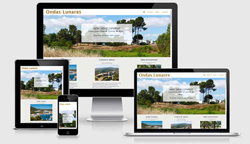

# EXPERIENCE (UX)
The target audience: Mainly, individuals who wish to buy a new-built villa, to use as a holiday home or a permanent home, but also people who sell villas (estate agents, investors...).

## User Stories
1. First Time Visitor Goals

   - As a potential client, I want to navigate the site easily 
   - I want to know what the company offers 

2. Returning Visitor Goals

   - I want access to more information on the villas, the area, the construction company
   - I want to find the Ondas Lunares contact details
   - I can request further information by mail or phone

3. Frequent User Goals

   - I expect to see updates on the progress of the current construction project(s) and photos of the completed first villa
   - I'm interested in the way the company expands
   - I want to see the future projects and maybe join a mailing list for a newsletter 

## Design

I looked at various architects websites for inspiration regarding layout, content, style... and found the sites below very inspiring:
-  [Linehan Construction & Restoration](https://architects.linehanconstruction.com/?gclid=Cj0KCQiAlMCOBhCZARIsANLid6Ze4Z-QJrfD01P0NZ2F8L2rwN5KyqBbYHwgyPJ2bXREqr5H2X0VJ70aAsqmEALw_wcB)
- [Wallnut](https://www.wallnut.pt/)

1. Colour Scheme

    The name of the company means "moon waves". I looked at some online moonlight photos and  paintings that inspired me to use shades of blue, ochre and off-white (like here: ["Pleine-lune"](https://quilteuseforever.files.wordpress.com/2014/11/pleine-lune.jpg)). I picked 3 colours: dark-slate-gray, sienna, linen.
    However, I had to replace the 'peru' colour by a darker shade to pass the accessibility requirements.
    
 
 
 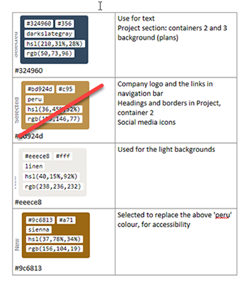
 

2. Typography

     The chosen font for this site is Work Sans. It looks elegant and easy to read. It works well on the Linehan Construction & Restoration website. The fallback font is Sans Serif (Work Sans being 'sans' serif.
   
3. Imagery

   The visitors to a construction website will expect to see photos of the finished products. As the construction is in progress, I use photos of similar completed projects, plans for the current project and images created by an interior designer (staging technic). 

## Wireframes

I chose to do a one-page website for the following reasons: 
The site is for a two-people startup company. In addition, builders don't need to provide tons of information online. Therefore, there is no need for multiple pages. Finally, a one-page website will be easy to maintain, simple to navigate and will offer a better mobile experience.

I made this decision after reading *"Website Battles: One-Page Website vs Multi-Page Website"* on [web.com](https://www.web.com/blog/start/website-design/website-battles--one-page-website-vs-multi-page-website) and *"How to Create a Beautiful One-Page Website"* on [wix.com](https://www.wix.com/blog/2018/08/how-to-create-one-page-website?utm_source=google&utm_medium=cpc&utm_campaign=9852964004^99403845119&experiment_id=^^433253293178^^_DSA&gclid=CjwKCAiA5t-OBhByEiwAhR-hm0JnFmcGlCjQBKoKQjyMFUJRnhZNgvEV_JOvAU0QFNWiuiDZP3zz4BoCx-8QAvD_BwE).

### Mobile wireframe:

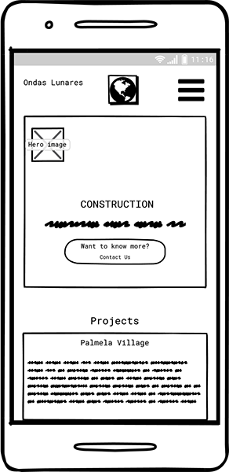

### Desktop wireframe:

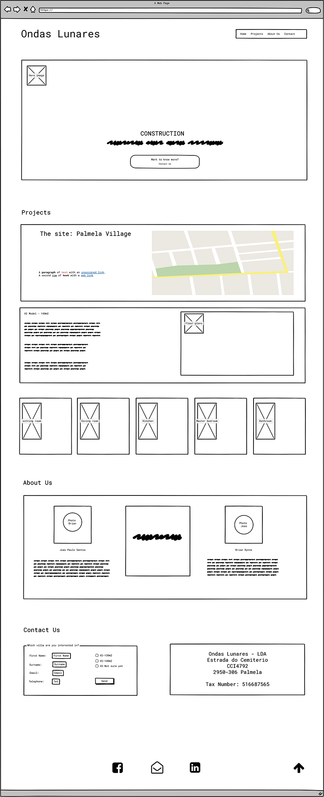

    
# FEATURES
The website is to inform potential buyers about the construction of new villas at Palmela Village. The buyers are most likely to be Lisbon commuters, investors, holiday makers. 

## Header
The logo, in the top left corner, is the name of the company. It's just text at the moment. The navigation menu, on the right, is short enough to be seen on small devices. I chose a fixed position for the header for a good visibility and convenience.
 
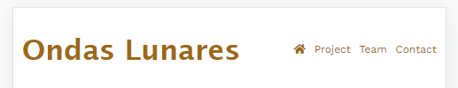

## Palmela Village
The hero image contains a centered heading which should catch the attention. It is unlikely that visitors will know much about the place itself however. I first present what is attractive about the area on the landing page, under the hero image. The hero image itself suggests that the village is in the countryside and the villas are modern. 

 

 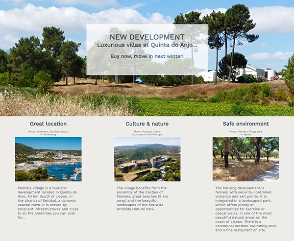

## Project
Assuming that the visitor likes the area, he/she will scroll down or navigate to the 'project section'. It's a basic layout of the V2 model villa to be built. To visualize the rooms, 5 mokeups have been added below the layout section.

 

 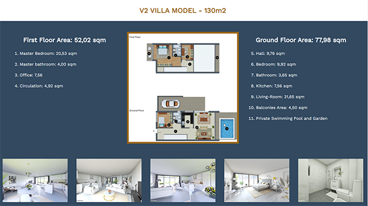

## Team
Showing photos and giving some information on the people who run the company and the staff inspires confidence; it is a common feature on most construction/architects websites.

 

 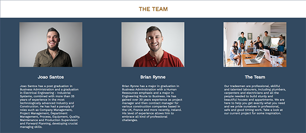

## Get in Touch
A potential buyer might want to receive more information, wish to speak to someone or visit Palmela village. This section should cover it.

 

 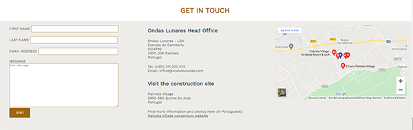

## Footer
The social media icons can be found here. 

 

 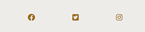

## Future features
- A proper logo designed in Illustrator or similar
- A Portuguese version of the whole website; maybe other languages will be added
- Photos of the new villas
- New villa models with plans
 

# TECHNOLOGIES USED
## Languages
- HTML
- CSS
## Frameworks
   - Google Fonts: Used to import the 'Work Sans' font into the style.css file 
   - Font Awesome: Used the home icon in the header menu and the social media icons in the footer for UX and design reasons
   - Git: Used for version control by utilizing the Gitpod terminal to commit to Git and Push to GitHub
   - GitHub: Used to store the projects code after being pushed from Git

## Programmes and tools
   - Photoshop and Paint: used to resize images and edit photos for the website
   - Balsamiq: Used to create the wireframes during the design process
   - Chrome extensions: 
      - Fonts Ninja, Eye Dropper, Dimensions, Image Size Info: Used when doing research on fonts, colors and images
      - WAVE Evalutation Tool: Used when testing accessibility

# TESTING
The validators below were used to check the errors and warnings. I had 1 error and 1 warning. The html code I copied from Google Map to display a map in my Get in Touch section was obsolete. I had to fix it by using CSS code. I also had to replace each h1 at the top of each section by h2 headings. The only remaining h1 being used is the Ondes Lunares logo. 

   - [W3C Markup Validator](https://jigsaw.w3.org/css-validator/validator?uri=https%3A%2F%2Fannickrynne.github.io%2Fondaslunares%2F&profile=css3svg&usermedium=all&warning=1&vextwarning=&lang=en) - Results: 0 errors/warnings

 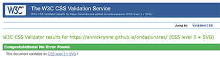

   - [W3C CSS Validator](https://validator.w3.org/nu/?doc=https%3A%2F%2Fannickrynne.github.io%2Fondaslunares%2F) - Results: 0 errors/warnings

 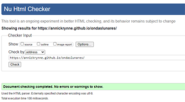

The website was successfully tested on Chrome, Microsoft Edge, Firefox and Safari, using 2 mobile phones (Lenovo P2a42 V7.0 and Poco MIUI 12, a DELL laptop and an Ipad Pro 10.5". 

# ACCESSIBILITY
I use the WAVE chrome extension to test accessibility. It first showed 7 contrast errors. This was fixed by changing a color (see my comments under "Design"). 

 

 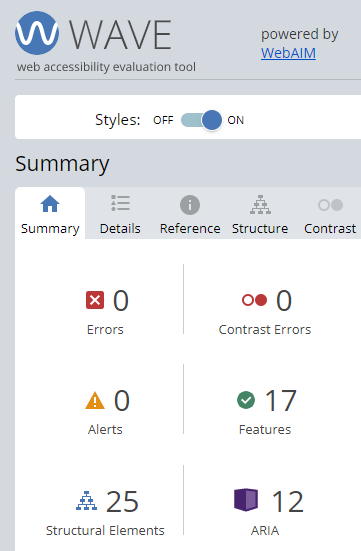

I tested the site in an incognito window to get the Lighthouse results: 

 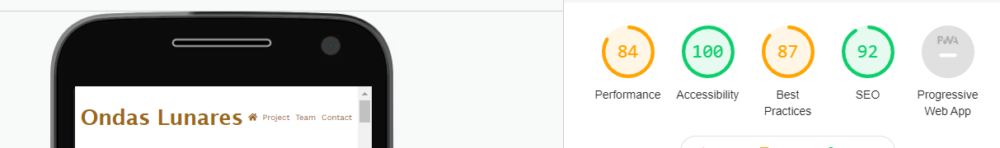

 

# DEPLOYMENT
This site was deployed to GitHub pages as per the following steps: 
<ul>
   <li>In the GitHub repository, select ondaslunares repository</li>
   <li>Navigate to the Settings tab and scroll down to the GitHub Pages, to "Pages settings now has its own dedicated tab!" and click on the link that says "Check it out here!"</li>
   <li>Select a source by clicking where it says "none" and then select "main"</li>
   <li>Scroll down to the bottom of the page, to the GitHub Pages section and you will see the link to the website</li>
</ul>

[Live site](https://annickrynne.github.io/ondaslunares/)

# CREDITS

 - Code: The social icons in the footer came from the "Love Running" project and I added the css:hover 
- Content: Written by myself
- Media: I put some captions for the images that were found on Pexels or belonged to IAD Portugal, who are partners. The images in the Team section are also from Pexels.
- Acknowledgements: Ed at Tutor Support for his advice on Google Map, Kasia and my cohort classmates for sharing useful information every day
- All the developers who post helpful videos on CSS Flexbox and Grids on YouTube
